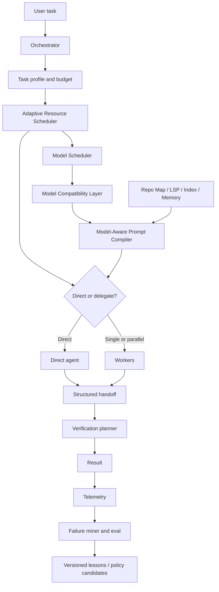
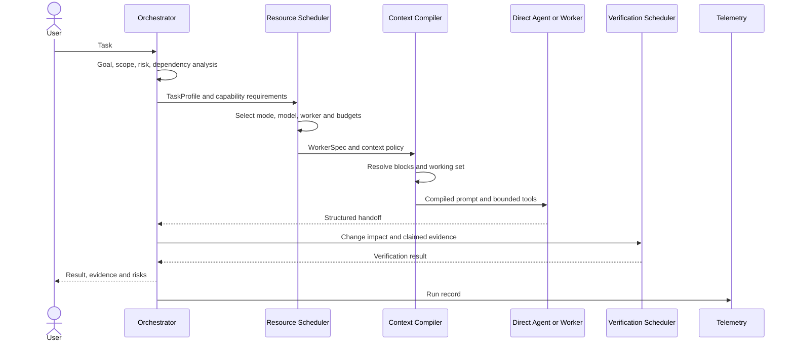
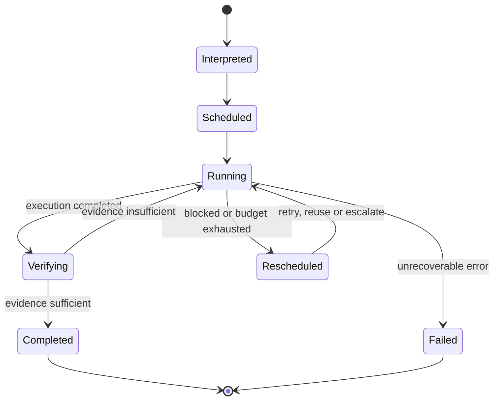
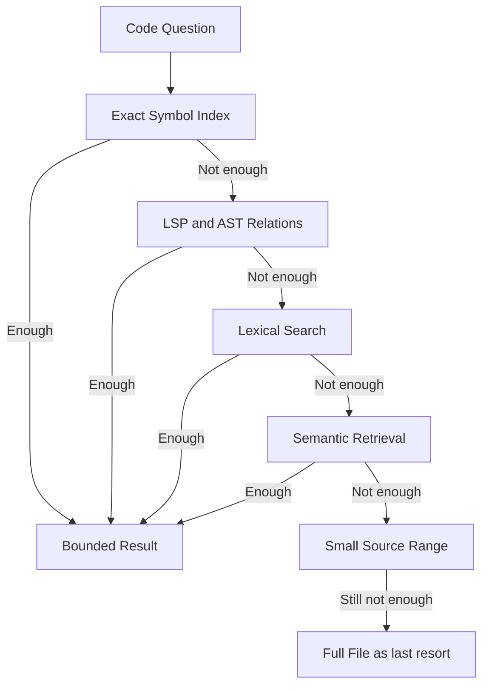
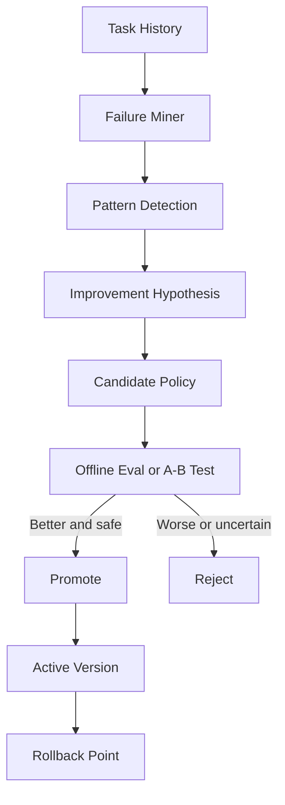
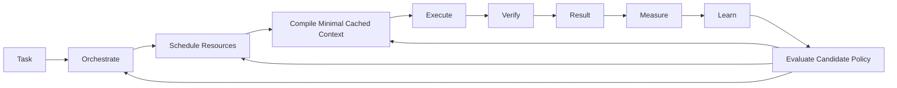

# DS-Plugins

基于 DeepSeek Harness（DSH）的个人 Coding Agent 插件方案。目标是构建一个 **ChatGPT/Codex-first、上下文经济、按需多 Agent、可评估演进** 的开发代理，而不是重写一个通用 Agent runtime。

> 当前状态：DSH v0.1 已实现 Direct / Single Worker、Handoff、预算与 targeted verification，并通过 keyless Loader/replay 验收。本仓库不执行本地源码或付费 provider smoke；`pnpm test:provider` 始终安全禁用。使用和限制见 [`packages/dsh-orchestrator/README.md`](packages/dsh-orchestrator/README.md)。

## Fedora development environment

本仓库直接使用 Fedora 系统工具链，不再依赖 Nix、Home Manager 或 direnv。需要 Node.js 24（也支持 Node.js 22.19+）、pnpm 11.7.0，以及 TypeScript 和原生扩展使用的编译工具。

### 1. 安装系统依赖

```bash
sudo dnf install nodejs npm git gcc gcc-c++ clang make cmake pkgconf-pkg-config \
  python3 uv rust cargo ripgrep fd-find jq tree-sitter-cli gdb strace gh
sudo npm install --global pnpm@11.7.0 typescript@5.9.3 typescript-language-server
```

安装后运行仓库检查器：

```bash
bash scripts/check-fedora-dev-env.sh
```

检查器要求 `package.json` 支持的 Node.js 版本、固定的 pnpm 11.7.0，以及项目开发和诊断所需命令。若 Fedora 的 `nodejs` 包提供了不兼容版本，请先停止，不要强行绕过版本检查。

### 2. 安装项目依赖

```bash
pnpm install --frozen-lockfile
pnpm typecheck
pnpm test
```

项目运行状态保存在仓库内的 `.dsh`。需要时在当前 shell 中设置：

```bash
export DSH_HOME="$PWD/.dsh"
```

### 3. 安装并运行 Harness 源码

```bash
mkdir -p upstream
git clone https://github.com/deepseek-ai/deepseek-harness.git upstream/deepseek-harness
cd upstream/deepseek-harness
pnpm --version
pnpm install
pnpm run typecheck
pnpm run build
DSH_HOME="$(cd ../.. && pwd -P)/.dsh" \
  node --expose-internals --import tsx/esm apps/cli/src/bin.ts web --no-open
```

浏览器访问 `http://127.0.0.1:3080`。Harness 会依据自己的 `package.json#packageManager` 使用对应的 pnpm 版本。

上面的命令使用 Harness 的源码入口运行 Web UI，并让它读取本仓库的 `.dsh` 状态目录。

如果 GitHub 来源的 TypeScript 插件依赖 `prepare` 构建，而 pnpm 10+ 报告脚本被忽略，请只在对应 profile 的 `pnpm-workspace.yaml` 中允许该包：

```yaml
allowBuilds:
  dsh-your-plugin: true
```

不要全局放开依赖构建脚本。

## 目录

- [Fedora development environment](#fedora-development-environment)
- [目标](#目标)
- [非目标](#非目标)
- [架构](#架构)
- [任务生命周期](#任务生命周期)
- [执行模型](#执行模型)
- [核心组件](#核心组件)
- [核心数据契约](#核心数据契约)
- [调度与模型兼容](#调度与模型兼容)
- [Context Compiler 与缓存](#context-compiler-与缓存)
- [Code Intelligence 与检索](#code-intelligence-与检索)
- [Memory 与 Handoff](#memory-与-handoff)
- [验证与演进](#验证与演进)
- [错误处理与安全边界](#错误处理与安全边界)
- [复用边界](#复用边界)
- [配置草案](#配置草案)
- [仓库、Package 与插件边界](#仓库package-与插件边界)
- [路线图](#路线图)
- [研究假设与验收指标](#研究假设与验收指标)

## 目标

- 优先通过官方或成熟适配器接入 ChatGPT/Codex 订阅；其他 API 和本地模型是后备选择。
- 由 Orchestrator 决定任务需要的能力，由 Model Scheduler 选择具体的 `模型 + prompt profile + reasoning effort`。
- 只有预期质量收益超过 token 与延迟成本时才委派 Worker。
- 使用 LSP、符号索引和 Repo Map 替代大段源码灌入；为每一步编译最小、相关的上下文。
- 在同一模型族内保持稳定 prompt 前缀，提高缓存复用率。
- 以任务证据驱动策略改进，候选变更须经评估后才能启用。

## 非目标

- 不 fork 或修改 DSH 核心 agent loop。
- 不维护自制 ChatGPT OAuth 或把订阅伪装成普通 API。
- 不把多 Agent、完整测试或自动策略修改设为默认行为。
- 不在没有评估和回滚机制的情况下让 Agent 改写自身运行时、安全边界或权限策略。

## 架构



DSH 提供 model、tool、session、subagent、sandbox 与 storage 的扩展点。本项目应作为插件层组合这些能力；上图中的模块通过事件、session event log 和工具接口协作，而不是侵入 runtime。

核心组件边界：

| 组件 | 负责 | 不负责 |
| --- | --- | --- |
| Task Interpreter | 将请求转为目标、约束、风险和能力需求 | 选择具体模型 |
| Orchestrator | 分解任务、建立依赖、聚合 Handoff、决定下一步 | Provider 认证、完整 Repo 阅读 |
| Resource Scheduler | 分配模型、Worker、Token、Context、Tool 和验证预算 | 生成最终 Prompt 文本 |
| Model Scheduler | 选择模型配置、升级、粘性和 fallback | 任务分解 |
| Provider Router | 认证、可用性、配额、限流和调用 | 认知层任务选择 |
| Compatibility Layer | 适配模型偏好的 Prompt 和工具契约 | 改变 WorkerSpec 语义 |
| Context Compiler | 选择、排序、去重和裁剪上下文 | 临时发明任务目标 |
| Code Intelligence | 提供有界、结构化的代码事实 | 替 Agent 做业务判断 |
| Verification Scheduler | 根据影响面和风险选择证据 | 无条件执行全量测试 |
| Telemetry / Evaluator | 记录结果、发现模式、评估候选策略 | 直接修改生产策略 |

## 任务生命周期



任务状态：



## 执行模型

| 模式 | 使用条件 | 执行方式 |
| --- | --- | --- |
| Direct | 简单解释、小范围修改、明确查找 | Orchestrator 直接完成，不创建 Worker。 |
| Single Worker | 任务边界明确且需要独立执行 | Orchestrator 提供最小任务包；Worker 返回结构化 handoff。 |
| Parallel Workers | 子任务相互独立、无共享写入冲突、并行收益可覆盖成本 | 按能力临时拆分，Orchestrator 汇总与验证。 |

Orchestrator 是调度器，不是承担所有工作的超级 Agent。它只维护目标、约束、Repo Map、计划、预算、Worker handoff 和未决问题。Worker 只接收任务、相关文件或符号、必要上下文、预算及期望输出。

Worker 不返回完整对话，只返回如下信息：

```yaml
status: completed
summary: concise result
changes: [affected paths]
evidence: [targeted verification]
risks: [remaining uncertainty]
next: [optional next action]
```

## 核心组件

### Task Interpreter 与 Orchestrator

Task Interpreter 提取目标、成功标准、显式约束、任务类型、难度、风险、时延敏感度、可能影响的模块和外部操作权限。Orchestrator 维护最小控制面：

```yaml
goal: user-visible outcome
constraints: []
task_graph: []
repo_map_refs: []
worker_handoffs: []
open_questions: []
budget_state: {}
```

Orchestrator 是认知调度器，不是承担所有工作的超级 Agent。它决定需要完成什么、子任务如何依赖、证据是否足够；不会默认读取完整代码库、硬编码具体模型或重复加载 Worker transcript。只有 Handoff 缺少证据或相互冲突时，才按引用查看原始记录。

### Adaptive Resource Scheduler

Scheduler 统一决定：

- Direct、Single Worker 或 Parallel Workers。
- 模型、Provider、prompt profile 和 reasoning effort。
- Worker 数量、复用、affinity 和生命周期。
- 输入、输出、步骤、工具调用、源码读取和时延预算。
- Context Block 数量及缓存策略。
- 验证预算和是否需要独立 Reviewer。

初期使用确定性规则和可解释阈值。只有积累足够 Telemetry 后，才考虑 contextual bandit 或在线探索。

### Provider Router

Provider Router 只处理 Authentication、可用性、配额、限流、调用和 Provider-specific 错误，不参与任务认知。ChatGPT/Codex 订阅不可用时必须明确报告原因；只有配置显式允许时才能降级到付费 API 或其他 Provider，禁止无提示产生额外费用。

### Model Compatibility Layer

统一 Worker 语义不代表统一字面 Prompt。Compatibility Layer 根据模型画像决定：

- System Prompt 形态与指令密度。
- Tool schema 数量、命名和描述长度。
- 消息顺序和 schema 放置位置。
- reasoning hints 和 agent loop 风格。
- compaction 后如何 re-anchor。
- 是否使用 minimal first turn。

### Prompt Compiler

Orchestrator 只生成 `WorkerSpec`。Prompt Compiler 负责验证字段、解析 Kernel 与 Policy 版本、排序和去重 Context Blocks、应用模型适配、计算 token、裁剪动态内容并生成 canonical Prompt。

同一份 `WorkerSpec` 可以编译为 Codex-native、DeepSeek-minimal 或其他模型形式，但任务目标、权限、成功标准和输出契约必须一致。

### Budget Manager

预算是一等公民：

```yaml
budget:
  max_input_tokens: 12000
  max_output_tokens: 4000
  max_steps: 8
  max_tool_calls: 20
  max_source_chars: 50000
  max_workers: 1
  max_wall_time_seconds: 180
```

接近预算时，Worker 必须停止无界探索并输出当前发现、实际证据、未决项和推荐下一步。Scheduler 决定继续、压缩、复用、升级、缩小范围或失败，Worker 不得静默越界。

### Worker Scheduler 与 Affinity

Worker 可以持有可复用的 warm context：

```yaml
worker:
  id: worker-7
  model_config: codex-native-high
  warm_modules: [auth, session]
  warm_symbols: [refreshToken, AuthClient]
  cached_tokens: 42000
  repo_revision: revision-id
  state: idle
```

新任务与 warm context 高度相关，且权限、模型和 Repo revision 仍兼容时优先复用。以下情况不复用：

- 上一任务含有不应跨任务传播的敏感上下文。
- Working Set 已过期或 Repo revision 不兼容。
- Worker 异常、达到寿命上限或存在未清理副作用。
- 新任务需要不同安全边界或明显不同的模型能力。

### Verification Scheduler

Verification Scheduler 接收变更文件、受影响符号、公共接口、风险、测试映射和 Worker 声称的证据，生成最低成本的充分验证计划。它独立判断证据，不信任 Worker 的完成声明。

## 核心数据契约

以下 YAML 是逻辑协议，不绑定最终序列化格式。

### TaskProfile

```yaml
task_profile:
  id: task-123
  type: debugging
  objective: Fix concurrent refresh-token race.
  difficulty: 0.78
  risk: 0.70
  independence: 0.60
  capabilities:
    coding: 0.95
    reasoning: 0.85
    repo_navigation: 0.75
    tool_use: 0.80
  constraints:
    include: [src/auth]
    exclude: [unrelated modules]
    max_latency_seconds: 180
    external_writes: forbidden
  success_criteria:
    - root cause identified
    - minimal fix produced
    - targeted verification passes
```

### ModelProfile

```yaml
model_profile:
  id: codex-native-high
  provider: chatgpt-codex
  model: configured-at-runtime
  reasoning_effort: high
  capabilities:
    coding: 0.94
    reasoning: 0.91
    debugging: 0.93
    repo_navigation: 0.90
    tool_use: 0.95
  operating:
    speed: 0.65
    quota_cost: 0.40
    monetary_cost: 0.00
  prompt_profile:
    adapter: codex-native
    instruction_density: medium
    preferred_tool_count: medium
    tool_schema_sensitivity: medium
    stable_prefix_priority: high
```

能力画像初值可人工配置，但历史统计必须按任务类型、Repo 特征和完整模型配置分别校准，不能用单一全局成功率代表模型能力。

### WorkerSpec

```yaml
worker_spec:
  kernel: coding-agent@v1
  policy:
    template: debugging@v1
  task:
    objective: Fix concurrent refresh-token race.
    scope: [src/auth]
    evidence: [intermittent token test failure]
    success_criteria:
      - root cause documented
      - minimal patch
      - targeted test passes
  context:
    repo_map: repo-map@42
    symbols: [refreshToken, Session.refresh]
    diagnostics: [token.ts:87 possible race]
    prior_handoffs: []
  resources:
    model_capability: high-coding
    token_budget: 12000
    tool_budget: 20
  permissions:
    write_scope: [src/auth, tests/auth]
    network: denied
  output:
    schema: handoff@v1
```

### ContextBlock

```yaml
context_block:
  id: auth-module-summary
  version: 7
  content_hash: sha256:example
  source: code-index
  repo_revision: revision-id
  token_count: 640
  stability: semi-stable
  dependencies: [src/auth/token.ts, src/auth/session.ts]
  content: bounded canonical content
```

### Handoff

```yaml
handoff:
  status: completed
  summary: OAuth refresh race fixed with single-flight coordination.
  changes:
    - path: src/auth/token.ts
      summary: serialize concurrent refresh calls
  evidence:
    - command: targeted auth test
      result: passed
  risks:
    - Redis-backed session path not exercised
  unresolved: []
  recommendation:
    - run auth integration test if risk threshold requires it
  transcript_ref: worker-7/session-21
```

Handoff 必须区分“已经执行的证据”和“建议执行的检查”，未运行的验证不得标为通过。

### RunTelemetry

```yaml
run:
  task:
    type: debugging
    difficulty: 0.72
  resources:
    model_config: codex-native-high
    worker_count: 1
    model_switches: 0
  context:
    total_tokens: 18000
    cached_tokens: 14000
    uncached_tokens: 4000
  behavior:
    tool_calls: 14
    source_reads: 3
    lsp_queries: 8
    retries: 1
  verification:
    level: targeted-test
    passed: true
  result:
    completed: true
    accepted: true
  latency_ms: 42000
```

## 调度与模型兼容

Model Scheduler 根据任务画像、预算、延迟、历史表现、缓存收益及 prompt compatibility 做决策，而不是按固定角色绑定模型。输入至少包括：

```yaml
task_profile:
  coding: high
  reasoning: medium
  tool_use: high
  repo_context: medium
  risk: medium
constraints:
  token_budget: 12000
  max_latency_seconds: 180
```

模型配置还需要描述 prompt 行为偏好。例如某模型可能偏好少工具、低指令密度的 minimal prompt；另一些模型更适合 Codex 原生工具契约。调度的原子单位因此是：

```text
provider + model + prompt profile + reasoning effort
```

Model Compatibility Layer 负责将统一的 WorkerSpec 编译为相应模型的 system prompt 形态、工具数量和命名、消息顺序、reasoning hints 及 compaction anchor。`dsh-minimal-first-turn` 一类实现应视为模型行为兼容参考，而非单纯 token 优化。

优先级是：**正确性与模型兼容 > 缓存局部性 > token 最小化**。不能为提高全局缓存命中，把不适合的模型强行置于同一种 prompt 形态。

### 模型效用

候选模型配置的效用可以表示为：

\[
U(m,t,p)=
\alpha P(success\mid m,t,p)
+\beta Quality(m,t,p)
-\gamma TokenCost
-\delta Latency
-\epsilon QuotaPressure
-\zeta FailureRisk
+\eta CacheBenefit
+\theta PromptCompatibility
\]

其中 `p` 是 prompt strategy。MVP 不需要复杂优化器，先用硬约束过滤和可解释的加权评分；公式用于明确需要观测的变量。

### Worker 启动条件

\[
Spawn \iff E[\Delta Quality] >
\lambda E[TokenCost] +
\mu E[Latency] +
\rho E[CacheLoss] +
\sigma E[CoordinationCost]
\]

硬约束优先于评分：子任务不独立、写入范围冲突、预算不足或无法形成明确 Handoff 时，不创建并行 Worker。

### Model Stickiness

仅当预期收益超过切换成本、缓存损失和状态转移风险时才切换：

\[
Switch(A\rightarrow B) \iff
ExpectedGain > SwitchCost + CacheLoss + StateTransferRisk
\]

以下信号允许升级或切换：

- 低置信度且连续无进展。
- 重复相同工具调用或错误达到阈值。
- 当前模型缺少必要上下文、工具或模态能力。
- 验证失败且根因超出当前 Worker 能力。
- Provider 不可用、配额耗尽或限流超过任务时限。

### Adaptive Escalation

Worker 阻塞时先生成 Handoff，再由 Scheduler 按成本顺序选择：

1. 补充上下文并继续当前 warm Worker。
2. 缩小任务或修正目标。
3. 提高 reasoning effort。
4. 切换更适合的模型配置。
5. 增加独立 Reviewer 或诊断 Worker。
6. 证据不足或风险过高时停止并请求用户输入。

高风险、复杂或紧急任务可以直接使用满足门槛的强模型，不要求所有任务从弱模型开始。

### Fallback 原则

- Provider 认证失败：报告并停止，不创建替代认证路径。
- 订阅模型不可用：仅使用用户已启用的 fallback。
- 付费 API fallback：必须显式配置和标识费用路径。
- 模型失败：保留 Handoff 和已验证事实，避免从零重做。
- 工具不可用：沿检索梯度降级，同时记录质量与 token 成本变化。

## Context Compiler 与缓存

Prompt ABI 表示语义层，不等于最终的字面 prompt：

```text
P0 Kernel       stable agent and tool contract
P1 Policy       reusable role and verification rules
P2 Task         task objective and constraints
P3 Working Set  relevant symbols, diagnostics, and files
P4 Turn         current tool result and local state
```

编译器应保持 P0/P1 顺序稳定，将任务与运行时数据置于尾部；缓存优化范围首先是同一模型族和同一 worker 的局部性，不追求跨模型的强行统一。

代码理解优先走 LSP、AST、符号索引、诊断和 Repo Map，且所有工具输出都应有明确上限。原始 session event、工具输出和完整源码只在需要时展开。

记忆分层：

- L0：不可直接全量注入的原始事件。
- L1：可复用的 turn summary。
- L2：当前任务状态、决定与待办。
- L3：项目约定和用户偏好。
- L4：Repo Map 与符号定位信息。

### Canonicalization

为保证缓存命中，Prompt Compiler 必须：

- 固定 Context Block 排序和结构化字段顺序。
- 删除重复规则与重复 Block。
- 不注入无必要的当前时间、随机 ID 或环境噪声。
- 不对未变化的摘要进行同义改写。
- 用版本和 hash 引用稳定内容。
- 在同一模型族内最大化 prefix reuse，不强求跨模型共享字面前缀。

### 缓存层次

| 缓存 | Key | 失效条件 |
| --- | --- | --- |
| Provider Prompt Cache | Provider 定义 | 前缀或 Provider 条件变化 |
| Compiled Prompt Cache | model profile + ordered block hashes | 相关 Block 或 adapter 变化 |
| Context Block Cache | block ID + version/hash | 来源或依赖变化 |
| Tool Result Cache | repo revision + tool version + normalized query | 相关文件、工具版本或配置变化 |
| Worker Warm State | worker + model profile + repo revision | 生命周期、安全域或依赖失效 |

工具缓存采用 dependency-aware invalidation：修改文件后只更新该文件的 symbols 和受影响 relationships，保留无关缓存。

### Context Eviction

达到预算时依次移除或降级：

1. 可重新查询的旧工具原始输出。
2. 与当前任务低相关的源码片段。
3. 已被结构化事实替代的重复文本。
4. 过期 Working Set 和已完成分支细节。
5. 仍必要但可压缩的事件摘要。

不得驱逐 P0 安全约束、P2 目标与成功标准、未解决风险和最近验证证据。

## Code Intelligence 与检索

Code Intelligence 统一封装 LSP、AST、Index、Git 和搜索，向 Agent 暴露：

```text
find_symbol(name)
get_definition(symbol)
get_references(symbol)
get_callers(symbol)
get_callees(symbol)
get_implementations(symbol)
get_diagnostics(path)
get_module_dependencies(path)
get_related_tests(symbol)
inspect_symbol(symbol, detail)
```

每个接口必须有结果数量、字符数、文件数或深度上限，并返回截断状态和继续检索游标。

### 检索梯度



优先级：`Symbol > Structural > Lexical > Semantic > Source`。

### Hierarchical Repo Map

| 层级 | 内容 | 默认注入 |
| --- | --- | --- |
| L0 Repository | 顶层目录、语言、构建入口 | 是 |
| L1 Module | 模块职责和依赖 | 相关模块 |
| L2 File | 文件职责和导出符号 | 按需 |
| L3 Symbol | 定义、签名、类型 | 按需 |
| L4 Relationships | callers、callees、tests、inheritance | 按需 |
| L5 Source | 小片段或完整文件 | 最后手段 |

Worker 初始只获得 Task、Repo Map 摘要和相关 symbols。信息不足时依次获取关系、诊断、小片段和源码；每次展开必须说明缺少什么信息。

### 增量索引

```text
changed file
  -> reparse file
  -> update symbols
  -> update affected relationships
  -> invalidate dependent cache entries
```

单文件修改不得触发全 Repo 重建。向量索引是结构化检索不足时的补充，不是默认入口。

## Memory 与 Handoff

| 层 | 内容 | 生命周期 | Prompt 策略 |
| --- | --- | --- | --- |
| L0 Raw Events | messages、tool calls、shell output、edits | 完整保留 | 不默认注入 |
| L1 Turn Summary | 单轮已完成、证据和未决项 | Session | 需要时引用 |
| L2 Task State | objective、completed、pending、decisions | Task | 作为稳定 Block |
| L3 Project Memory | 工具链、约定、模块知识 | Project | 按相关性注入 |
| L4 Durable Lessons | 多次任务验证的稳定经验 | Versioned | 进入候选 Policy/Skill |

Memory 不将一次偶然结果直接升级为长期规则。Observation 必须经过重复证据、冲突检查和适用范围定义，才成为候选 Lesson。


Handoff 解决任务状态转移，不只是对话摘要；它必须包含状态、结论、变更、实际证据、风险、未决项、推荐下一步和原始记录引用。

## 验证与演进

Verification Planner 按变更风险选择最低成本的充分证据：文档不跑测试；局部工具函数跑相关单测；公共 API 增加类型检查和相关测试；核心 runtime 才扩大范围。

“自进化”限定为可审计的策略优化：

```text
task evidence -> failure analysis -> candidate change -> eval -> promote or reject
```

项目记忆可自动更新；skills、上下文选择规则和任务 recipe 可提出候选；system prompt、路由和派生策略必须经评估；runtime、sandbox 和权限策略禁止自动提升。

### 风险驱动的验证矩阵

| 变更类型 | 默认验证 |
| --- | --- |
| 文档、注释、纯格式 | Markdown/差异检查；不跑测试 |
| 局部无分支配置 | 语法或静态检查 |
| 工具函数、状态分支 | Targeted unit test |
| Parser、序列化、错误处理 | 相关测试和边界用例 |
| 公共 API 或跨模块契约 | 相关测试 + typecheck/build |
| 核心 runtime、权限、安全 | 扩大测试、集成验证和独立审查 |
| 依赖、构建、迁移 | 安装/构建/迁移验证，必要时全量测试 |

扩大验证范围的信号：公共接口或共享状态变化、回滚困难、数据丢失风险、Targeted test 无法覆盖原始症状、Worker 证据与 diff 不一致，或影响分析发现多个下游消费者。

### Telemetry

v0.2 evaluation serializes the per-run source metric as `source_token_estimate` (the legacy `source_tokens_per_task` name means the same quantity). Per-run uncached input is `uncached_source_tokens`; aggregate `uncached_tokens_per_success` is reported only by `PromotionReportV1`.

关键指标：

```text
task_success_rate
accepted_result_rate
cache_hit_ratio
uncached_tokens_per_success
source_token_estimate
uncached_source_tokens
lsp_to_source_ratio
worker_spawn_rate
worker_reuse_rate
model_switch_rate
retry_rate
verification_cost
latency_per_success
fallback_rate
```

Failure Taxonomy：

```text
context_loss
insufficient_context
context_bloat
bad_reasoning
wrong_model
prompt_incompatibility
tool_misuse
premature_edit
implementation_error
verification_gap
scope_creep
bad_handoff
bad_routing
provider_failure
budget_exhaustion
```

失败必须记录根因类别和证据，不能只有成功/失败布尔值。

### 受控演进闭环



| 等级 | 对象 | 允许动作 |
| --- | --- | --- |
| L1 | Repo knowledge、Task Memory、用户偏好 | 来源明确时自动更新 |
| L2 | Skill、Context retrieval、Worker template、Tool preference | 自动生成候选，不自动上线 |
| L3 | Kernel Prompt、Model routing、Spawn、Verification Policy | 必须经 Eval 和版本审批 |
| L4 | Runtime、Permission、Sandbox、Security | 禁止自动上线 |

高风险任务禁止在线探索。低风险任务只有在样本足够、可回滚且用户允许时，才可进行小比例 exploration。

## 错误处理与安全边界

| 场景 | 行为 |
| --- | --- |
| TaskProfile 不完整 | 使用安全默认值；关键范围或权限不明确时请求用户输入 |
| Context 超预算 | 按 eviction policy 裁剪；不可删除安全和成功标准 |
| Worker 超预算 | 强制 Handoff，由 Scheduler 决定是否续期 |
| Worker 结果冲突 | 保留双方证据，进行最小独立验证或请求 Reviewer |
| Tool 结果截断 | 标明截断和游标，不把局部结果声称为完整结果 |
| Index 过期 | 回退到结构化搜索或源码，并触发增量更新 |
| Provider 限流 | 等待窗口可接受则重试，否则使用显式启用的 fallback |
| 订阅认证失败 | 明确报错，不静默使用付费 API |
| 验证失败 | 不宣称完成；返回失败证据并重新调度或停止 |
| 外部写入或破坏性操作 | 遵循用户授权和 sandbox，未授权则停止 |

所有 Worker 继承最小权限；并行 Worker 必须有明确写入范围。原始 transcript、凭据和敏感文件不得因 Worker reuse 跨安全域传播。

## 复用边界

以下结论来自 [awesome-dsh-plugin](https://raw.githubusercontent.com/awesome-dsh-plugin/awesome-dsh-plugin/main/README.zh.md) 及各项目 README 的交叉阅读。这里的“可直接复用”只表示接口和职责与本方案相邻，仍需在本机确认 DSH 版本、Node 版本、许可证、Windows 支持和权限边界；“可借鉴”不应作为运行时依赖。

### 可直接复用

| 项目 | 可直接拿什么 | 接入前门槛 |
| --- | --- | --- |
| [`dsh-lsp-actions`](https://github.com/PerryLink/dsh-lsp-actions) | 8 类 LSP 动作、官方 `ctx.lsp` 优先、stdio fallback、写入意图/沙箱、结果上限和真实 TypeScript LSP E2E 测试。 | 确认 DSH/Node 版本和目标语言服务器；不把它的无跨会话缓存误当成项目记忆。 |
| [`dsh-engineering-workflow`](https://github.com/82c86b8z86-stack/dsh-engineering-workflow) | 需求、计划审批、TDD、并行子代理、验证五阶段硬门槛，以及可复用 preset/skills。 | 与本方案已有的策略门禁去重，避免同一阶段出现两套状态机。 |
| [`dsh-telemetry-redactor`](https://github.com/030611/dsh-telemetry-redactor) | 对外发出的 telemetry 副本做凭据/隐私模式脱敏，同时保留 canonical log。 | 仅是常见模式匹配，不是完整 DLP；核对 listener 顺序和脱敏覆盖率。 |
| [`dsh-verification-receipt`](https://github.com/030611/dsh-verification-receipt) | 本地隐私最小化 JSONL receipt，记录工具调用计数和启发式验证信号。 | 只能证明“执行过哪些信号”，不能证明测试真正通过或结果正确。 |
| [`dsh-openai-oauth`](https://github.com/AdonisSheldon/dsh-openai-oauth) | PKCE/device-code 登录、refresh token 和 Codex 模型接入。 | 条件复用：当前 README 标注 macOS/Linux，凭据写入明文 JSON；Windows 安全存储和凭据策略未解决前不直接纳入核心路径。 |

### 需适配或抽取

| 项目 | 值得抽取的能力 | 不直接照搬的部分 |
| --- | --- | --- |
| [`dsh-project-memory`](https://github.com/00080000/dsh-project-memory) | 读取时索引、正则符号表、BM25 检索、`path:line` 引用、哈希增量刷新和经验笔记。 | 进程内锁、跨进程 last-writer-wins，以及绝对源码路径限制；需适配本方案的 cache/context schema。 |
| [`dsh-task-relay`](https://github.com/LeslieWylie/dsh-task-relay) | `task_push/list/claim/done/cancel`、handoff 读写、共享 JSON 队列原子写入、输入校验和 session ownership。 | 它不是 DAG 调度器；还要处理 peer 版本、source/lib 产物同步和跨 worker 一致性。 |
| [`DSH-Subagent-Model-Router`](https://github.com/CypherNaught-0x/DSH-Subagent-Model-Router) | `subagent_model`、等待子代理、别名、`toolFilter`、`outputSchema`、`maxDepth` 和后台子代理。 | 抽取路由合同即可，不把其模型目录、UI/settings 命名空间绑定到核心架构。 |
| [`dsh-tier-router`](https://github.com/BruceLanLan/dsh-tier-router) | strong/cheap 分层、计划/执行分流、fallback TTL、失败自动升级、高影响操作保护和子代理分层。 | 把它当路由策略样例，重新接入本方案的预算、affinity 和 evidence 信号。 |

### 仅借鉴设计

| 项目 | 借鉴点 | 明确不复用 |
| --- | --- | --- |
| [`dsh-codex-harness`](https://github.com/shuind/dsh-codex-harness) | Codex prompt/tool contract、`exec_command`、`write_stdin`、`apply_patch`、计划更新、Fast 和 compaction fallback。 | 它不提供本方案的 provider、context compiler 或缓存实现。 |
| [`dsh-codex-shim`](https://github.com/OpenTritium/dsh-codex-shim) | 能力门控、工具词汇映射和“shim 不等于运行时”的边界。 | README 明确不提供 OAuth、provider、凭据或搜索后端，不能当成 Codex runtime。 |
| [`dsh-minimal-first-turn`](https://github.com/ZRui-C/dsh-minimal-first-turn) | 首轮最小 prompt/tool 集、恢复 full preset、compaction 后重复的实验方法。 | root-only、全局开关且当前 Windows 不支持；只能作为 A/B 实验参考。 |
| [`dsh-proactive`](https://github.com/beijingwahw/dsh-proactive) | shadow mode、反馈/衰减、kill switch、canary/rollback、预算和可观测性设计。 | 不整体引入其庞大的自治、经济和分布式系统；先落地可验证的小闭环。 |
| [`dsh-trace`](https://github.com/vibeinging/dsh-trace) | event/trace 字段和因果链表达方式。 | 默认不引入其 retention/private distribution 假设，统一纳入本方案 telemetry schema。 |

### 筛选结论

落地顺序建议为：`dsh-lsp-actions` → `dsh-engineering-workflow` → （可选）telemetry redaction/receipt → `dsh-project-memory` 轻量适配 → Windows 与凭据策略通过后再评估 OAuth。真正需要自行实现的差异化能力仍是 Adaptive Resource Scheduler、Cache-Aware Context Compiler、Worker Affinity、统一 telemetry/evidence schema，以及 evidence-driven policy evolution。

安全边界必须单独保留：awesome 列表的收录不等于安全审计，第三方插件会以宿主权限运行，可能读取文件、使用凭据或访问网络；安装前应审阅源码、权限和依赖。

## 配置草案

以下结构用于明确边界，不代表已经实现：

```yaml
providers:
  priority:
    - chatgpt-codex
    - configured-api
    - local
  allow_paid_fallback: false

scheduler:
  max_workers: 3
  parallel_only_when_independent: true
  model_stickiness: true
  worker_affinity: true
  exploration_rate: 0

budgets:
  task_total_tokens: 50000
  worker_input_tokens: 12000
  worker_output_tokens: 4000
  worker_steps: 8
  worker_tool_calls: 20

context:
  stable_prefix: true
  max_source_chars_per_worker: 50000
  retrieval_order:
    - symbol
    - structural
    - lexical
    - semantic
    - source

verification:
  policy: risk-aware
  full_suite: only-when-required

evolution:
  collect_telemetry: true
  auto_propose: false
  auto_promote: false
```

Provider 缓存、模型行为和项目规模都会变化，因此预算、阈值和 affinity 必须可校准；但 v0.1 不为尚未出现的需求建立完整配置框架。

## 仓库、Package 与插件边界

仓库边界、代码包边界和运行时插件边界不要求一一对应。本项目在 v0.6 之前保持一个 pnpm monorepo，在同一仓库内维护可独立测试和版本化的 packages、DSH 插件及组合 Profile。这样可以让共享契约、DSH ABI 升级、Loader/replay 和跨插件安全验证保持原子一致，同时避免跨仓库联调、临时发布和版本漂移。

目标结构如下；名称表示职责方向，不要求立即重命名现有 package：

```text
DS-Plugins/
├── README.md
├── HANDOFF.md
├── packages/
│   ├── contracts/                 # 纯库：共享协议、解析器和安全投影
│   ├── context-cache/             # 纯库：持久化缓存实现
│   ├── eval/                      # 离线评估与 promotion gate
│   ├── plugin-orchestrator/       # 运行时插件：任务、Worker、Handoff
│   ├── plugin-code-intelligence/  # 运行时插件：索引与 Context Compiler
│   ├── plugin-scheduler/          # v0.3 运行时插件：模型与资源调度
│   ├── plugin-telemetry/          # v0.5 运行时插件：有界证据采集
│   └── plugin-verification/       # 条件性插件：独立权限或后端出现后再拆
├── profiles/
│   ├── minimal/
│   ├── coding/
│   ├── adaptive/
│   └── experimental/
└── tests/
    ├── loader/
    ├── replay/
    └── eval/
```

插件演进目标是 4 个主插件、最多 5 个，而不是每个 package 都成为插件：

| 插件 | 归属能力 | 计划 |
| --- | --- | --- |
| Orchestrator | Direct/Worker、预算、Handoff、Task DAG、并行与文件所有权 | 保留现有插件并在 v0.4 扩展 |
| Code Intelligence | Snapshot、Repo Map、Symbol Index、Context Compiler、渐进展开 | 保留现有插件；cache 继续作为内部库 |
| Adaptive Scheduler | Model/Provider 选择、quota、stickiness、affinity、escalation | v0.3 新增 |
| Telemetry | 有界事件采集、脱敏、持久化和导出 | v0.5 新增；分析与学习保持离线 |
| Verification | 验证计划与安全执行后端 | 仅在出现多个消费者、独立权限或可替换后端时拆分 |

`contracts`、`context-cache` 和 `eval` 没有独立运行时生命周期，默认保持纯 package。v0.6 的 Offline Eval、A/B、Promotion 和 Rollback 是离线治理流程，不创建拥有自动提权或自动发布能力的常驻 Self-Evolution 插件。Profile 负责固定插件版本、权限、预算和推荐组合，不承担功能实现。

只有当模块具有稳定公开契约，并出现独立安装/替换、不同权限边界、两个以上真实消费者或独立发布回滚需求时，才将 package 提升为插件。只有当插件存在不同维护团队或许可证/公开性边界、服务多个宿主项目、需要独立供应链审计，或 monorepo 的 affected-package CI 已无法控制成本时，才拆 Git repo。即使未来满足条件，也优先按 `agent-core`、`code-intelligence`、`observability` 三个产品域拆分，而不是一插件一仓库。

## 路线图

### v0.1：基础运行闭环

实现、配置、hard limit、Handoff、验证 allowlist 及 provider-smoke 边界见 [`@ds-plugins/dsh-orchestrator`](packages/dsh-orchestrator/README.md)。当前仅提供 keyless 验收；本仓库没有真实 provider 或 coding-task 验收路径。

交付：

- 复用或接入一个 Codex subscription provider。
- Direct / Single Worker 两种模式。
- Worker Prompt ABI、WorkerSpec 和 Handoff schema。
- 基础 Token、Step 和 Tool Budget。
- Targeted Verification。

退出标准：能完成真实 Coding 任务；Orchestrator 不需要读取 Worker 完整 transcript；失败时有明确 Handoff 和证据。

### v0.2：Token Economy（已完成）

状态：v0.2a、v0.2b 和 v0.2c 的计划范围均已进入 `main`。当前实现覆盖共享契约与固定评估语料、只读 Code Intelligence、不可变 Context Blocks、Cache-Aware Context Compiler、有界持久化缓存、渐进式源码展开、独立 Profile，以及 Loader/replay 和 promotion gate。v0.2 的完成指仓库定义的 keyless 范围和退出门槛已满足；不代表 provider、网络隔离或真实 coding-task 验收。

交付：

- LSP、Symbol Index 和分层 Repo Map。
- Cache-Aware Context Compiler。
- Immutable Context Blocks 和 Tool Result Cache。
- Progressive Disclosure 和有界工具输出。

退出标准：相对 `grep + full file read` 基线，成功任务的源码输入和 uncached tokens 可测量下降，成功率不显著降低。

#### v0.2a：评估基线与安全边界（已完成）

v0.2a 只验证固定 fixture corpus 的 baseline、共享契约、路径安全、评估指标和插件兼容性 checker：12 个 task，覆盖 `ts-small`、`ts-medium`、`ts-layered` 三种 repository shape；tokenizer 固定为 `@dqbd/tiktoken@1.0.22` 的 `cl100k_base`。v0.2a 不实现 snapshot、Symbol Index、Repo Map、cache，也不证明 provider 或真实 coding-task acceptance。

#### v0.2b：只读 Code Intelligence（已完成）

v0.2b 已在固定 12-task corpus 上完成 keyless promotion gate：cold/warm 的 median source-token reduction 均为 `0.7260683760683762`，mean symbol-query recall@5、target coverage、oracle success 均为 `1`，uncached tokens per success 为 `17.5`；两种条件均通过 `≥ 0.25/0.95/0.95/0.95` 阈值。每个 task 生成 3 次 cold 与 3 次 warm optimized 记录，明确不宣称 cache benefit。该结果只证明固定 fixture、fallback/index、read-only projections、Loader/replay 与评估链路；不证明 provider、网络隔离或真实 coding-task acceptance。`dsh-lsp-actions` 当前决策为 `patch-required`，未安装、未进入默认 profile；详见 [`dsh-lsp-actions compatibility review`](docs/superpowers/reviews/2026-08-30-dsh-lsp-actions-compatibility.md)。

`@ds-plugins/dsh-code-intelligence` 声明了标准 `dsh.bundle`，本地构建后可由 DSH 插件管理命令识别并加入 Profile 的 bundle 栈：

```bash
pnpm --filter @ds-plugins/dsh-code-intelligence build
cd upstream/deepseek-harness
pnpm dsh plugin --profile web add link:/home/sihan/Projects/DS-Plugins/packages/dsh-code-intelligence
```

安装只负责激活 bundle；仍需在目标 Profile 的 `cordis.patch.yml` 中为 `dsh-code-intelligence` 配置指向目标仓库的 `deploymentRoot` 和相应边界参数。

#### v0.2c：Context Blocks 与有界缓存（已完成）

v0.2c 已合入 `main`：`@ds-plugins/dsh-context` 作为不可变 ContextBlockV1 契约权威，`@ds-plugins/dsh-context-cache` 作为边界感知的持久化缓存，`@ds-plugins/dsh-code-intelligence` 把既有 Repo Map / Symbol Query 投影通过 `context-compiler` 编译成有界 context block 并提供 provenance 校验的渐进式 source-window 展开，`@ds-plugins/dsh-orchestrator` 仅在 v0.2c overlay 中消费可选 `contextCompiler` 服务。缓存只存在于受信任 deployment root 下的 `.dsh-context-cache/v1/`，使用 mode 0700、同目录临时文件 + 原子 rename、独占锁，并执行依赖哈希失效、LRU 淘汰与 quarantine。`profiles/v0.1` 保持不变；该 overlay 不启用 provider 或 write-capable tool。

最新 keyless gate 证据（2026-08-31，cached Node v24.19.0）：`pnpm test:v0.2c` 完成全部 package build，并通过 33 个测试文件 / 268 个测试；其中完整 12-task promotion gate 通过，cold/warm median source-token reduction 均为 `0.7260683760683762`，mean symbol-query recall@5、target coverage 和 oracle success 均为 `1`。cold/warm replay 如实报告缓存 hit/miss。该结果只证明不可变 block、边界缓存、progressive disclosure、只读 context tools、Loader/replay 和固定语料评估链路；不证明 provider、网络隔离或真实 coding-task acceptance。

### v0.3：Adaptive Scheduling

状态：已实现并通过 v0.3 keyless gate。详见 [`2026-09-01-dsh-v0.3-adaptive-scheduling-design.md`](docs/superpowers/specs/2026-09-01-dsh-v0.3-adaptive-scheduling-design.md)。验收保持 keyless 边界与 `profiles/v0.1` 不变；不宣称 provider、网络隔离或真实 coding-task 验收。

独立的 `profiles/v0.3-adaptive` overlay 组合纯 scheduling contracts、独立 Adaptive Scheduler service 和 Orchestrator-owned hard admission。验收仅覆盖 keyless replay：不访问 provider、credential、network、quota/cost endpoint、raw transcript 或真实 coding-task；`pnpm test:provider` 仍是固定的 `DISABLED` safety check。使用 `pnpm test:v0.3` 运行 v0.3 gate；本次沙箱无法完成精确 pnpm 命令（SQLite/registry 限制），报告中的通过证据是等价的 cached-Node `node --expose-internals ./node_modules/vitest/vitest.mjs ...` 命令。

插件归属：新增独立 Adaptive Scheduler 插件；Orchestrator 只提交能力请求并消费路由决定，Scheduler 缺失时安全退化到 Profile 的固定路线。

交付：

- Model Scheduler 和 Provider quota awareness。
- Model Stickiness、Worker Affinity 和 Adaptive Escalation。
- 按任务类型维护历史模型表现。

退出标准：相对固定强模型基线，单位成功任务资源成本下降，质量和失败率处于预设容忍区间。

### v0.4：Economical Multi-Agent

Task 14 real-Loader acceptance and the economical full gate are verified (2026-09-05, cached Node v22.23.1): the real `profiles/v0.3-adaptive` Loader overlay creates an actual Session and internal `parallelExecution` service; the acceptance fixture starts two independent children concurrently, asserts non-empty `maxDepth: 1` and child tool filters, confirms passed integrated verification with `test:profile` command evidence in the actual Session replay, and replays those events through `validateParallelEventReplay`. The full `pnpm test:v0.4` gate passes 38 files / 607 tests; `tsc -b` and `git diff --check` exit 0.

插件归属：继续扩展 Orchestrator，不另建 DAG 或 Worker 插件；Scheduler 负责资源选择和 affinity，Orchestrator 负责依赖、所有权和生命周期。

交付：

- Task DAG 和独立性判断。
- 有文件所有权约束的 Parallel Workers。
- Shared Stable Prefix、Worker Reuse 和 Context Locality。

退出标准：仅在可并行任务上产生可测量的时延或质量收益，普通任务的 Worker 数量不膨胀。

### v0.5：Telemetry 与学习

插件归属：新增 Telemetry 插件负责有界、脱敏的运行证据；Failure Miner、Lesson 校准和候选生成保持离线 package，不允许采集插件直接修改生产策略。

交付：

- 统一运行指标和 Failure Taxonomy。
- Failure Miner、Lesson Store 和模型画像校准。
- 版本化 Skill、Prompt 和 Routing 候选。

退出标准：每条候选改进能追溯到重复任务证据，而不是单次主观判断。

### v0.6：受控 Self-Evolution

插件归属：不新增常驻 Self-Evolution 插件；使用离线 eval、版本化 Profile/策略和人工审批完成 Promotion 与 Rollback。Verification 仅在独立权限、多个消费者或可替换执行后端成为实际需求后，才从 Orchestrator 拆为第 5 个插件。

交付：

- Offline Eval、受控 A/B、Promotion 和 Rollback。
- Kernel、Template、Routing 和 Verification Policy 的版本治理。
- 安全边界和人工审批门。

退出标准：候选策略在独立评估上改善目标指标，回滚路径经过验证，runtime 和权限变更仍不能自动上线。

## 研究假设与验收指标

### H1：Code Intelligence 能显著减少源码 token

比较 `grep + read_file` 与 `LSP + Symbol Index`。记录 `source_tokens_per_task`、`uncached_tokens_per_success`、成功率和定位准确率。

### H2：Stable Prompt ABI 能提高缓存命中

比较动态 Worker Prompt 与固定 `P0 + P1 + P2 + P3 + P4`。记录 `cache_hit_ratio`、uncached tokens、Prompt 编译稳定性和任务质量。

### H3：Worker Affinity 能减少重复上下文

比较每任务创建新 Worker 与复用 warm Worker。记录 uncached tokens、延迟、成功率和跨任务污染率。

### H4：Adaptive Routing 优于固定强模型

比较 Always Strong Model 与 Adaptive Scheduler。记录成功任务数 / uncached tokens、质量、失败成本、配额消耗和延迟。

### H5：Risk-aware Verification 能降低成本且不增加漏检

比较默认全量测试与影响分析驱动的 targeted verification。记录验证耗时、验证 token、后续失败率和漏检率。

### H6：Model Compatibility Layer 改善 Agent 行为

比较统一大型 Prompt 与 model-native adapter。记录工具调用成功率、无效步骤数、任务完成率、cache hit 和总成本。

### 实现前验证清单

- 候选 Provider 是否满足订阅认证、配额读取和 Windows 支持要求。
- DSH 当前插件 API、session event 和 subagent 生命周期是否覆盖设计所需扩展点。
- Provider 实际暴露哪些 Prompt cache 指标；无法直接观测时使用什么代理指标。
- LSP 插件支持哪些语言、结果上限和增量失效机制。
- Worker session 是否可安全复用，以及可复用的最大生命周期。
- Telemetry 的隐私、凭据脱敏和本地存储策略。

## 成功标准

- 简单任务不产生无意义的 Worker。
- Worker 能在预算内交付可验证的结构化 handoff。
- 代码定位优先依赖结构化工具而不是大范围文件读取。
- 缓存指标按模型族与任务类型可观测。
- 每条可推广的策略均可追溯到任务证据和评估结果。
- Provider fallback 不会静默产生额外费用。
- 验证失败时系统不会声称任务完成。
- 不同 Model Adapter 保持相同 WorkerSpec 语义和权限边界。

## 最终闭环



项目的核心不是“让更多 Agent 使用更多模型”，而是让每次模型调用都拥有足够、相关、稳定且可复用的上下文，并以最小充分证据交付结果。
